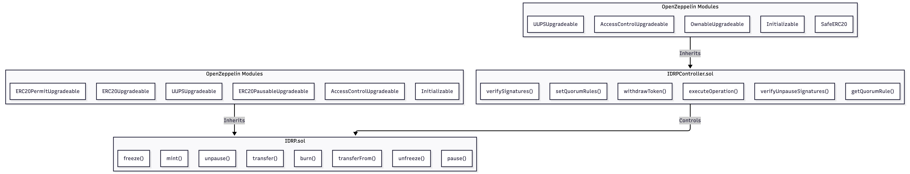
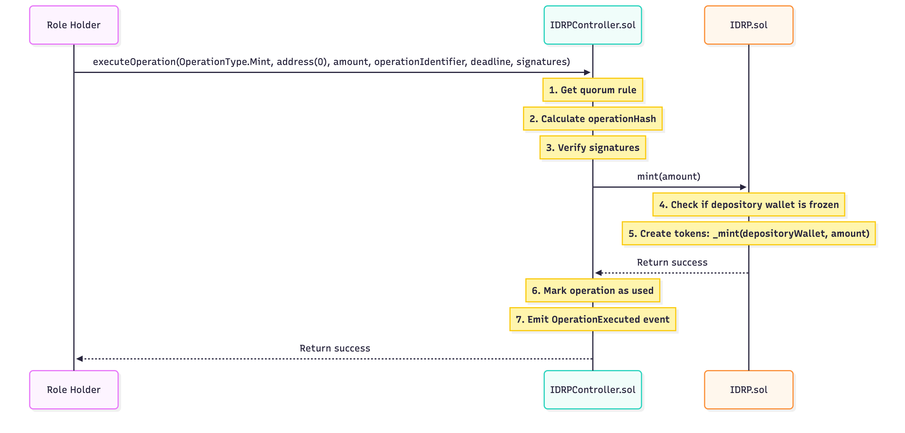
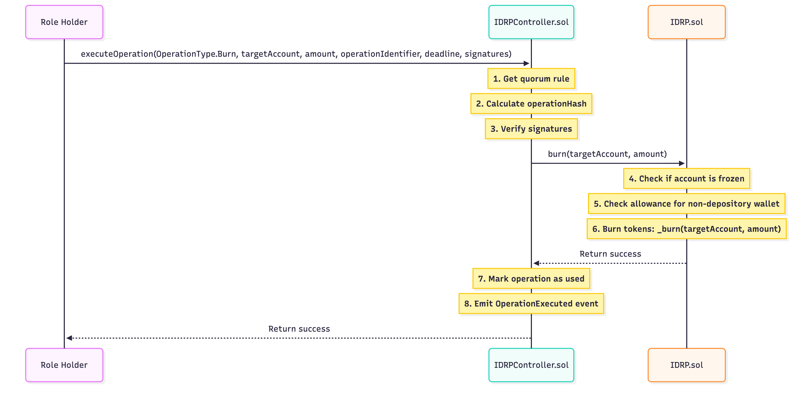
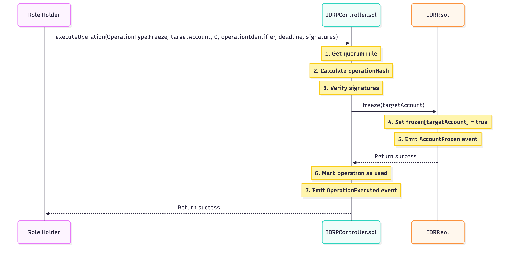
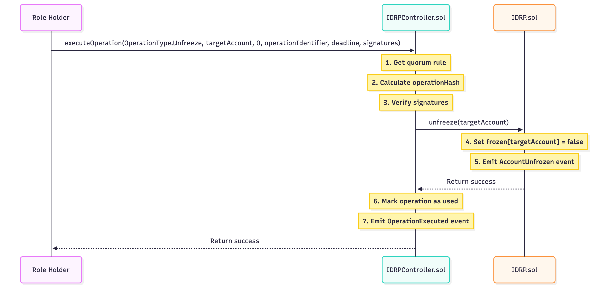
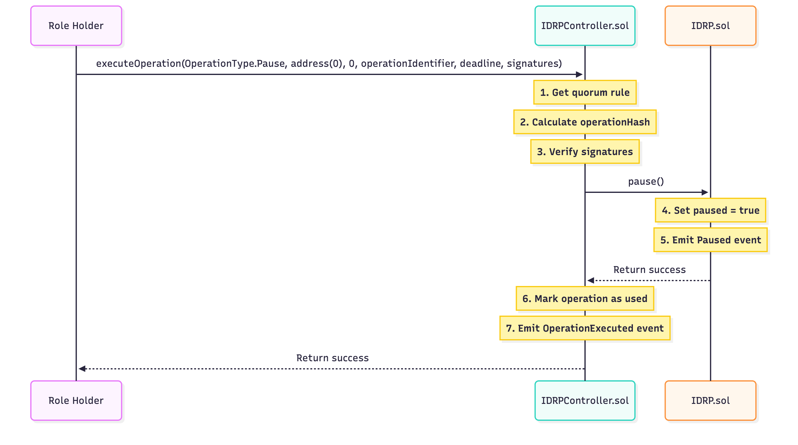
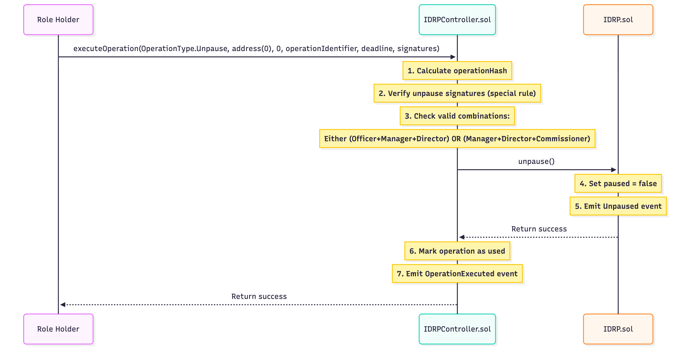
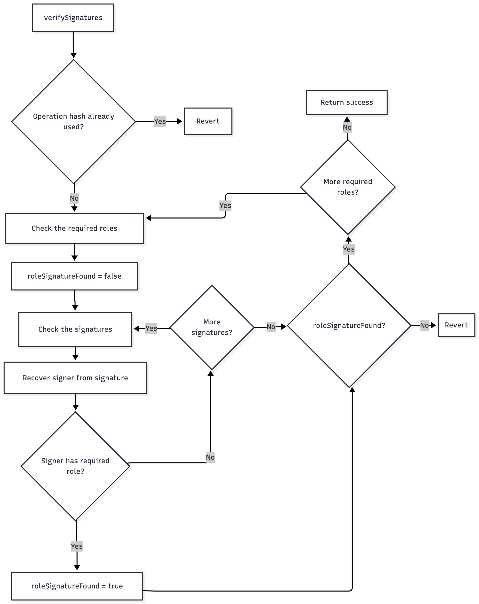
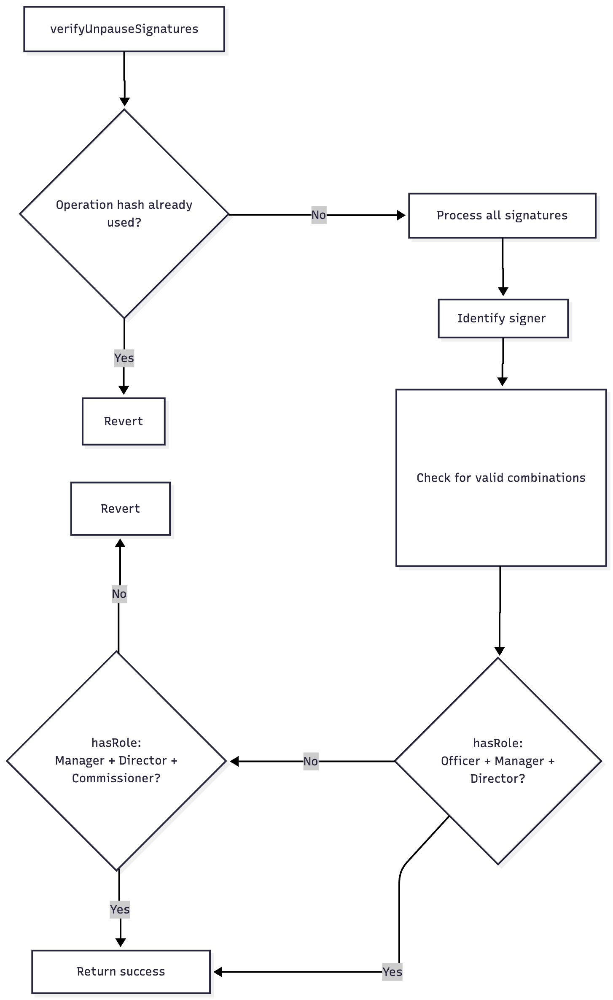

# IDRP Smart Contract Architecture

This document describes the IDRP smart contract architecture, component relationships, and function diagrams to illustrate how the smart contract system works together.

## System Overview

The IDRP system consists of two main smart contracts that work together to provide a robust, governed token system:



## Contract Architecture

### IDRP.sol (Token Contract)

The IDRP contract implements the ERC20 token standard with additional functionality for regulatory compliance.

#### OpenZeppelin Modules

| Module | Purpose |
|--------|---------|
| **Initializable** | Enables initialization pattern for upgradeable contracts, replacing constructors |
| **ERC20Upgradeable** | Implements the ERC20 token standard with upgradeable pattern |
| **ERC20PausableUpgradeable** | Adds ability to pause all token transfers during emergencies |
| **AccessControlUpgradeable** | Provides role-based permissions and access control |
| **ERC20PermitUpgradeable** | Adds EIP-2612 permit functionality for gasless approvals |
| **UUPSUpgradeable** | Implements the Universal Upgradeable Proxy Standard pattern |

#### Key Functions

| Function | Description | Caller |
|----------|-------------|--------|
| `mint(uint256 amount)` | Creates new tokens | IDRPController only |
| `burn(address from, uint256 amount)` | Destroys tokens from specific account | IDRPController only |
| `freeze(address account)` | Restricts account from transfers | IDRPController only |
| `unfreeze(address account)` | Removes restrictions from account | IDRPController only |
| `pause()` | Pauses all token transfers | IDRPController only |
| `unpause()` | Resumes token transfers | IDRPController only |
| `transfer(address to, uint256 amount)` | Transfers tokens (overridden) | Any non-frozen account |
| `transferFrom(address from, address to, uint256 amount)` | Transfers with allowance (overridden) | Any account with allowance |

### IDRPController.sol (Management Contract)

The IDRPController implements a sophisticated governance layer for the IDRP token with role-based access control and multi-signature functionality.

#### OpenZeppelin Modules

| Module | Purpose |
|--------|---------|
| **Initializable** | Enables initialization pattern for upgradeable contracts |
| **AccessControlUpgradeable** | Provides role-based governance and access control |
| **OwnableUpgradeable** | Adds contract ownership with transfer capabilities |
| **UUPSUpgradeable** | Implements the Universal Upgradeable Proxy Standard pattern |

#### Key Functions

| Function | Description | Caller |
|----------|-------------|--------|
| `setQuorumRules(OperationType, QuorumRule[])` | Sets governance rules | ADMIN_ROLE |
| `executeOperation(OperationType, address, uint256, string, uint256, bytes[])` | Executes governed operations | Any role holder |
| `verifySignatures(bytes32, bytes32[], bytes[])` | Verifies multi-signatures | Internal |
| `verifyUnpauseSignatures(bytes32, bytes[])` | Special verification for unpause | Internal |
| `getQuorumRule(OperationType, uint256)` | Gets appropriate rule for amount | Public view |
| `withdrawToken(address, address, uint256)` | Recovers non-IDRP tokens | Owner only |


#### Role-Based Access Control

The IDRP controller has role-based access control to manage permissions for various operations:
- `DEFAULT_ADMIN_ROLE`: Full administrative control, can assign/revoke roles.
- `ADMIN_ROLE`: Can set quorum rules and manage other roles.
- `OFFICER_ROLE`, `MANAGER_ROLE`, `DIRECTOR_ROLE`, `COMMISSIONER_ROLE`: Can propose and execute operations based on quorum rules.

## Flow

This section outlines the technical flow of key operations in the IDRP smart contract system, focusing on the technical interaction between contracts and functions.

### 1. Token Operation Execution Flow

<!-- ```
┌───────────┐     ┌─────────────────┐     ┌───────────────────────────────────────────┐     ┌─────────────┐
│           │     │                 │     │                                           │     │             │
│  Signers  │────►│ executeOperation│────►│ verifySignatures / verifyUnpauseSignatures│────►│ IIDRP calls │
│           │     │                 │     │                                           │     │             │
└───────────┘     └─────────────────┘     └───────────────────────────────────────────┘     └─────────────┘
``` -->


#### 1.1 Mint Operation



#### 1.2. Burn Operation



#### 1.3 Freeze Operation


#### 1.4 Unfreeze Operation


#### 1.5 Pause Operation


#### 1.6 Unpause Operation



### 2. Signature Verification Process

#### 2.1 General Signature Verification
Verify that all required signatures are present and valid



#### 2.2 Special Unpause Signature Verification
Verify that all required signatures are present and valid for unpausing the contract



