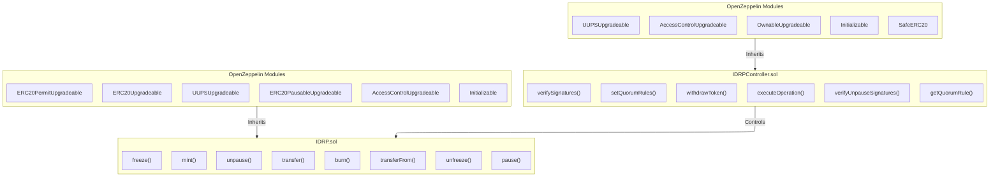
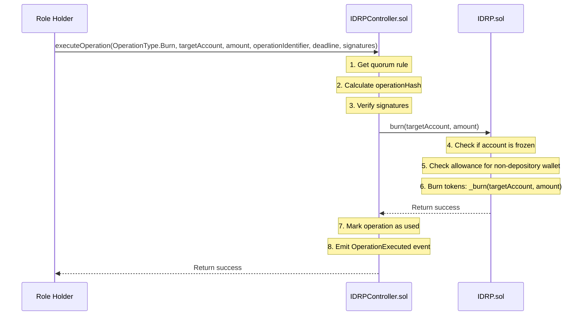
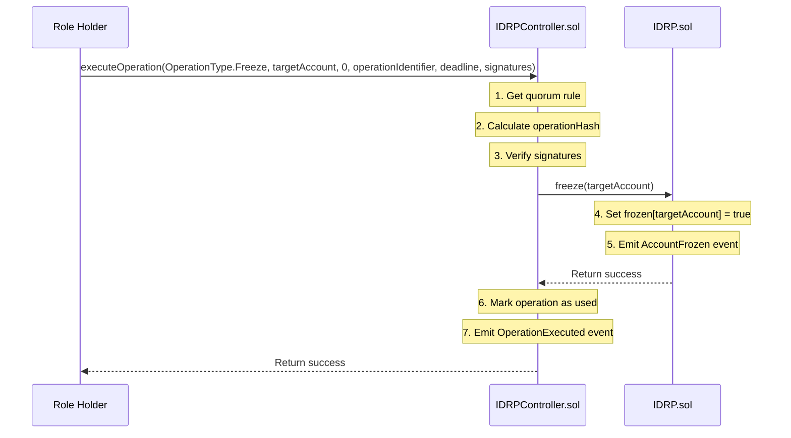
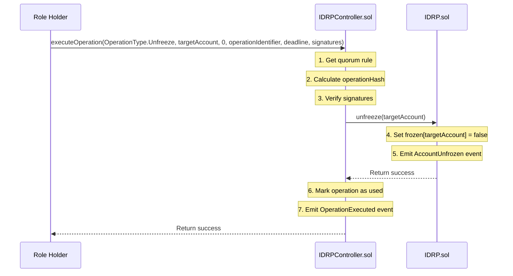
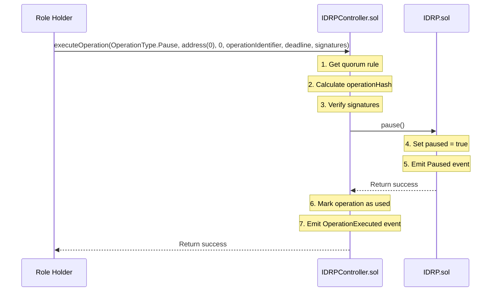
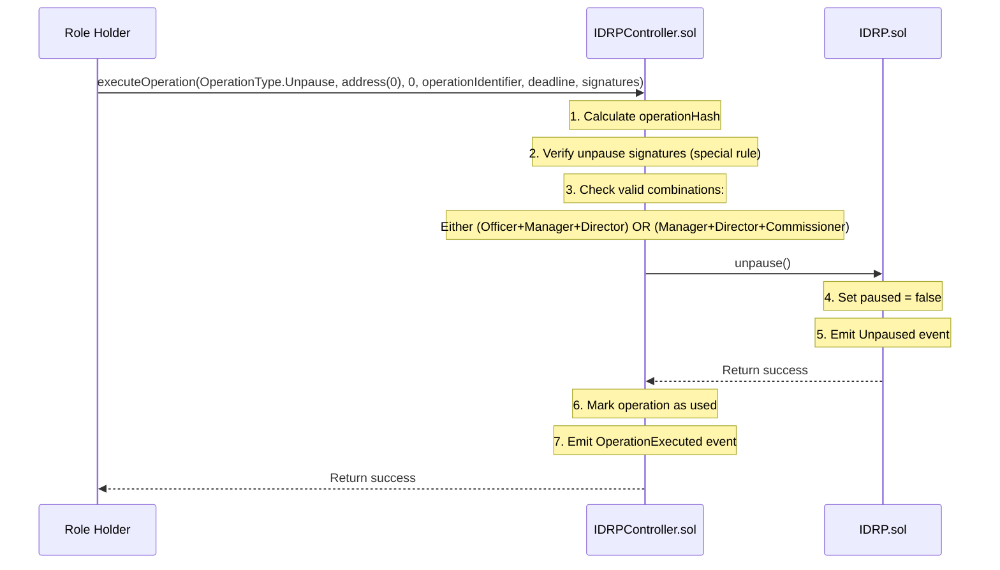
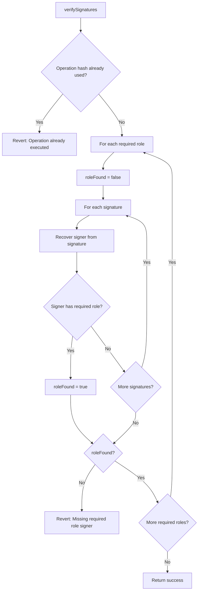
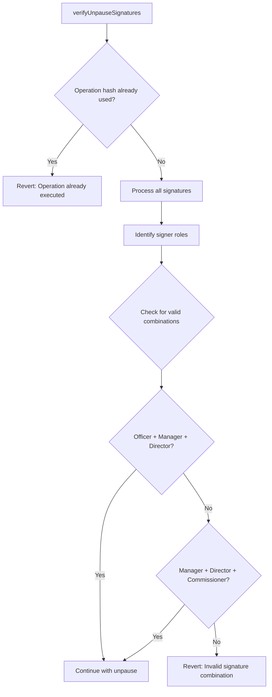

## System Overview

The IDRP system consists of two main smart contracts that work together to provide a robust, governed token system:

```
┌───────────────────────────────┐     ┌──────────────────────────────┐
│                               │     │                              │
│  IDRPController.sol           │     │  IDRP.sol                    │
│  - Governance & Management    │     │  - ERC20 Token Implementation│
│  - Multi-signature Controls   │────►│                              │
│                               │     │                              │
│                               │     │                              │
└───────────────────────────────┘     └──────────────────────────────┘
           ▲                                      ▲
           │                                      │
           │                                      │
           │                                      │
┌──────────┴──────────────────┐     ┌─────────────┴──────────────────┐
│                             │     │                                │
│  OpenZeppelin Modules     │     │  OpenZeppelin Modules        │
│  - AccessControlUpgradeable │     │  - ERC20Upgradeable            │
│  - OwnableUpgradeable       │     │  - ERC20PausableUpgradeable    │
│  - UUPSUpgradeable          │     │  - ERC20PermitUpgradeable      │
│  - Initializable            │     │  - AccessControlUpgradeable    │
│                             │     │  - Initializable               │
│                             │     │  - UUPSUpgradeable             │
└─────────────────────────────┘     └────────────────────────────────┘
```

#### Diagram code



## Technical Flow

### 1. Mint Operation Technical Flow

##### Diagram Code
```
sequenceDiagram
    participant RH as Role Holder
    participant IC as IDRPController.sol
    participant IDRP as IDRP.sol
    
    RH->>IC: executeOperation(OperationType.Mint, address(0), amount, operationIdentifier, deadline, signatures)
    Note over IC: 1. Get quorum rule
    Note over IC: 2. Calculate operationHash
    Note over IC: 3. Verify signatures
    IC->>IDRP: mint(amount)
    Note over IDRP: 4. Check if depository wallet is frozen
    Note over IDRP: 5. Create tokens: _mint(depositoryWallet, amount)
    IDRP-->>IC: Return success
    Note over IC: 6. Mark operation as used
    Note over IC: 7. Emit OperationExecuted event
    IC-->>RH: Return success
```

### 2. Burn Operation Technical Flow

##### Diagram Code


### 3. Freeze Account Technical Flow
##### Diagram Code


### 4. Unfreeze Account Technical Flow
##### Diagram Code


### 5. Pause Technical Flow
##### Diagram Code


### 6. Unpause Technical Flow
##### Diagram Code



### 2.1 General Signature Verification


### 2.2 Special Unpause Signature Verification
