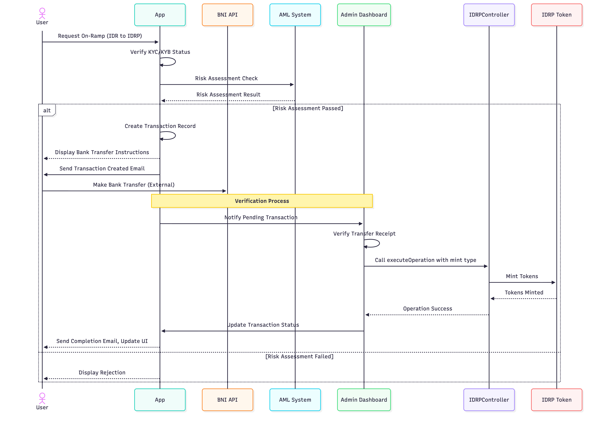
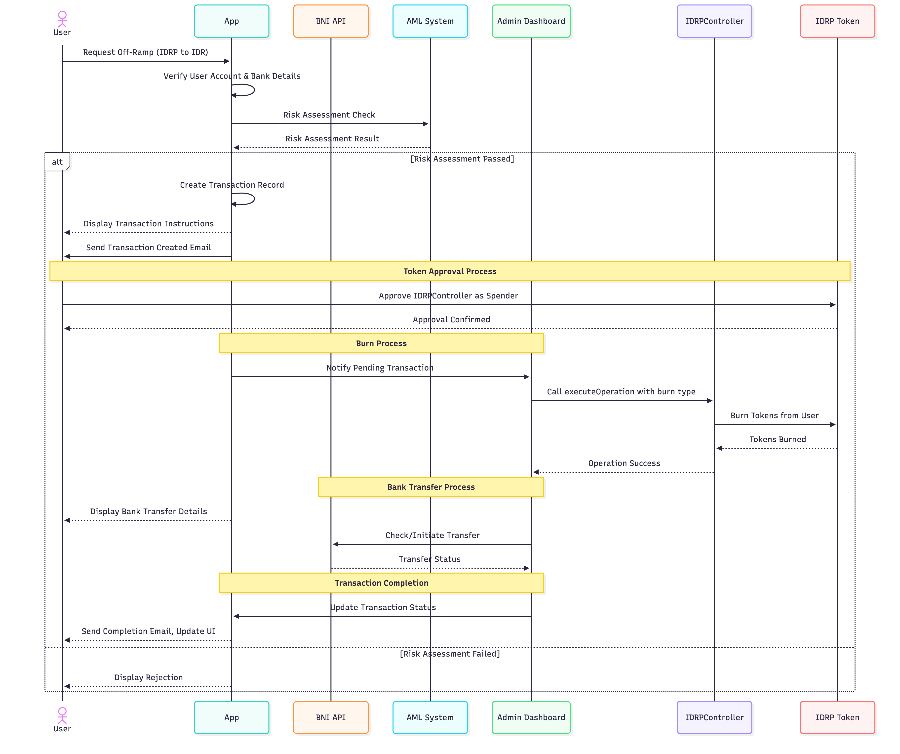
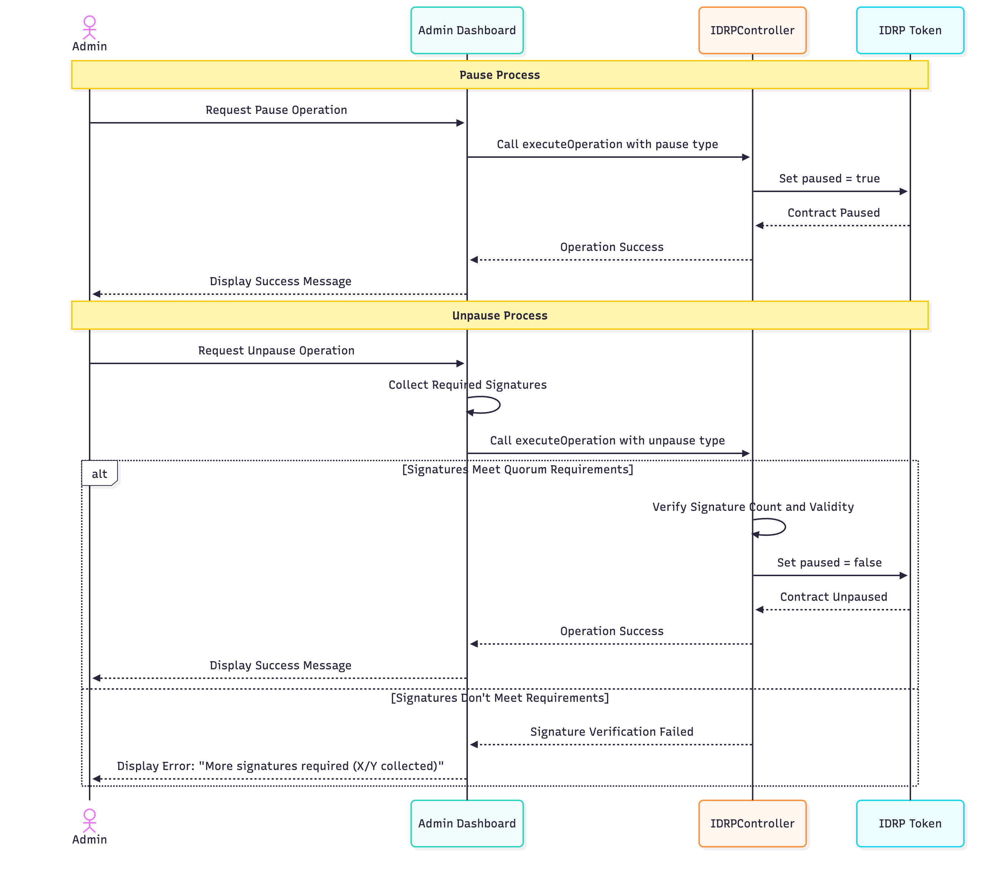
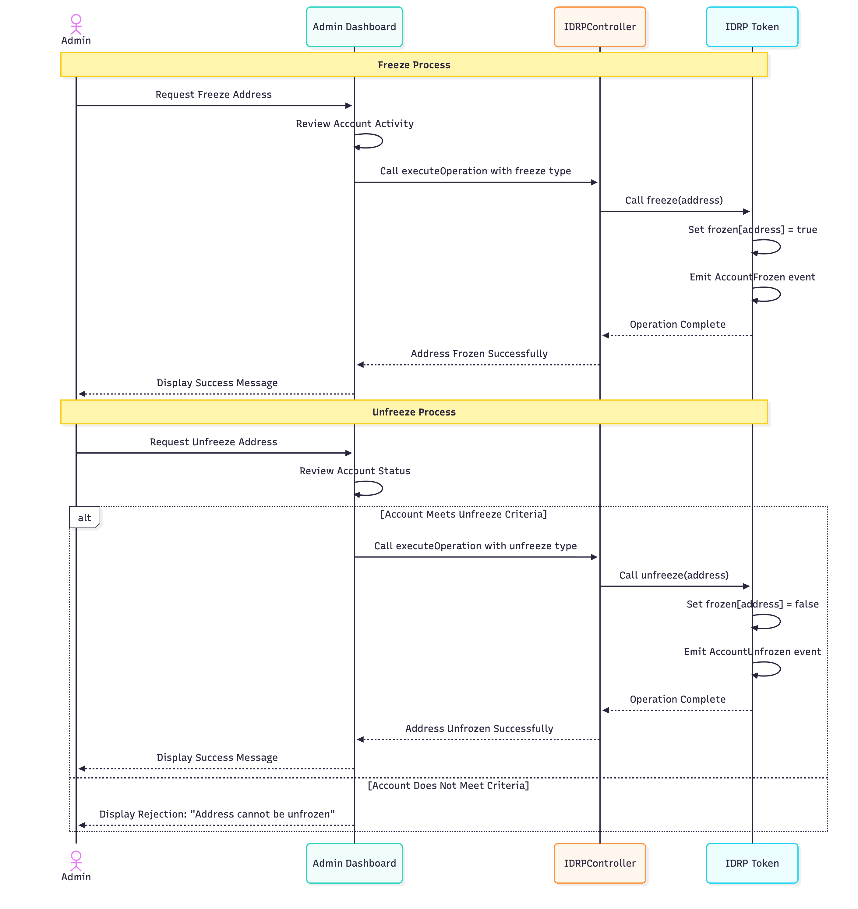
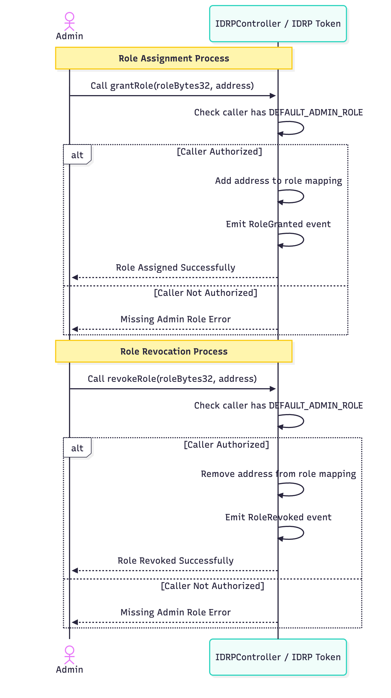

# IDRP Smart Contract Business Process

## Table of Contents
1. Introduction to IDRP
2. Smart Contract Architecture Overview
3. Business Processes
   - 3.1 Onramp Process (Minting)
   - 3.2 Offramp Process (Burning)
   - 3.3 Pause/Unpause Operations
   - 3.4 Freeze/Unfreeze Operations
4. Governance Processes

## 1. Introduction to IDRP

IDRP is a stablecoin project built on blockchain technology that facilitates digital representations of the Indonesian Rupiah. The system combines smart contract technology with traditional banking infrastructure to create a bridge between traditional finance and cryptocurrency.

## 2. Smart Contract Architecture Overview

The IDRP system is built on two primary smart contracts:
- `IDRP.sol`: The main token contract implementing the ERC20 standard
- `IDRPController.sol`: Controller contract that manages key operations including minting, burning, freezing, and pausing

The system uses a proxy pattern for upgradability and implements multi-signature requirements for critical operations. For detailed architecture, refer to the [IDRP Smart Contract Architecture](../arch/3.SMART_CONTRACT_ARCH.md) document.

## 3. Business Processes

### 3.1 Onramp Process (Minting)

The onramp process enables users to convert fiat currency (IDR) to IDRP tokens.

#### Detailed Minting Process:
1. User logs into the platform and requests to mint IDRP tokens
2. System verifies user's KYC/KYB status
3. System performs AML check on the transaction
4. If AML check passes:
   - App creates transaction record and displays bank transfer instructions
   - User receives email with transaction details
   - User makes bank transfer to the designated IDRP account
   - App notifies Admin of pending transaction
   - Admin verifies the transfer receipt
   - Admin calls `executeOperation` with mint type on the IDRPController
   - IDRPController mints tokens to user's wallet address
5. Transaction details are recorded in the database
6. User receives notification of completed minting

### 3.2 Offramp Process (Burning)

The offramp process allows users to convert IDRP tokens back to fiat currency (IDR).

#### Detailed Burning Process:
1. User logs into the platform and requests to burn IDRP tokens
2. System verifies user's identity and bank account details
3. System performs AML check on the transaction
4. If AML check passes:
   - App creates transaction record and displays transaction instructions
   - User receives email with transaction details
   - User approves the IDRPController contract to spend their IDRP tokens
   - App notifies Admin of pending transaction
   - Admin calls `executeOperation` with burn type on the IDRPController
   - IDRPController burns tokens from the user's wallet
   - Admin arranges bank transfer to user's registered bank account
5. Transaction details are recorded in the database
6. User receives notification of completed burning and fiat transfer

### 3.3 Pause/Unpause Operations

The platform includes emergency functions to pause and unpause the contract in case of security incidents.

#### Detailed Pause/Unpause Process:
1. Pause:
   - Admin can pause contract operations in emergency situations
   - When paused, minting, burning, and transfers are disabled
   - Requires single admin signature

2. Unpause:
   - Unpausing requires multiple signatures according to quorum rules
   - Each admin provides their signature
   - System verifies signature count meets quorum threshold
   - Contract operations resume after successful unpause

### 3.4 Freeze/Unfreeze Operations

The platform can freeze individual user addresses if suspicious activity is detected.

#### Detailed Freeze/Unfreeze Process:
1. Freeze:
   - Admin can freeze specific addresses if suspicious activity is detected
   - Frozen addresses cannot transfer tokens
   - Requires admin signature

2. Unfreeze:
   - Unfreezing an address requires review of risk factors
   - Address must pass AML checks before being unfrozen
   - Requires admin signature

## 4. Governance Processes

### 4.1 Wallet Role Assignment

The IDRP system implements role-based access control to manage permissions for various operations on the smart contracts. Assigning the appropriate roles to wallet addresses is a critical governance process.

#### Detailed Role Assignment Process:
1. An administrator directly interacts with the `IDRPController` or `IDRP` smart contract
2. Administrator calls `grantRole(bytes32 role, address account)` on the contract
3. The contract verifies the caller has `DEFAULT_ADMIN_ROLE`
4. If authorized, the address is assigned the requested role
5. The contract emits a `RoleGranted` event to the blockchain
6. The role assignment is recorded on-chain and visible through blockchain explorers
