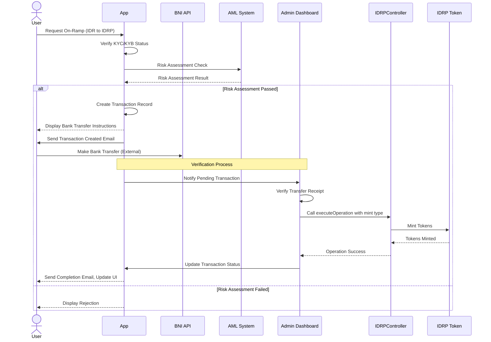
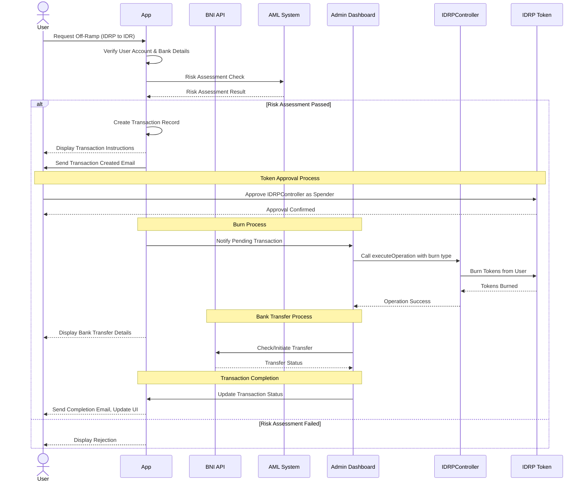
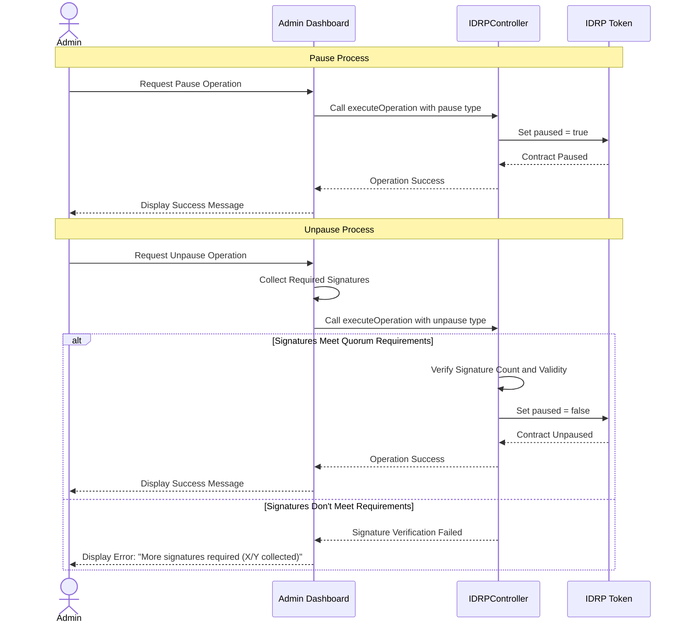
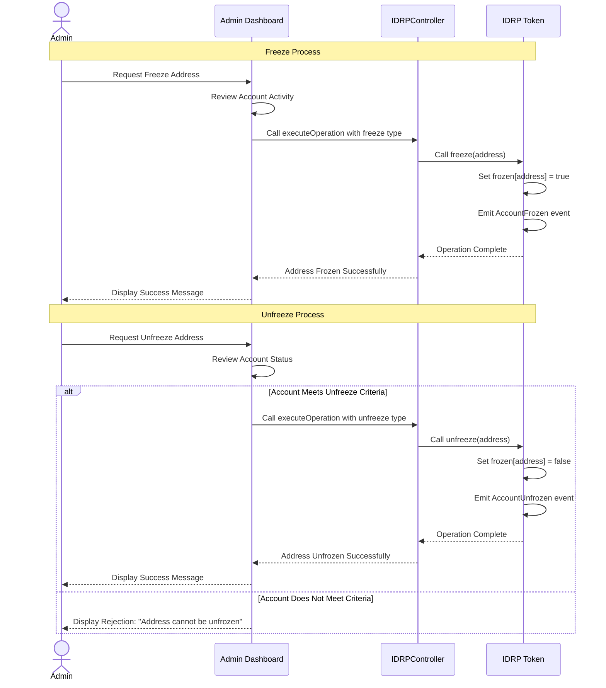
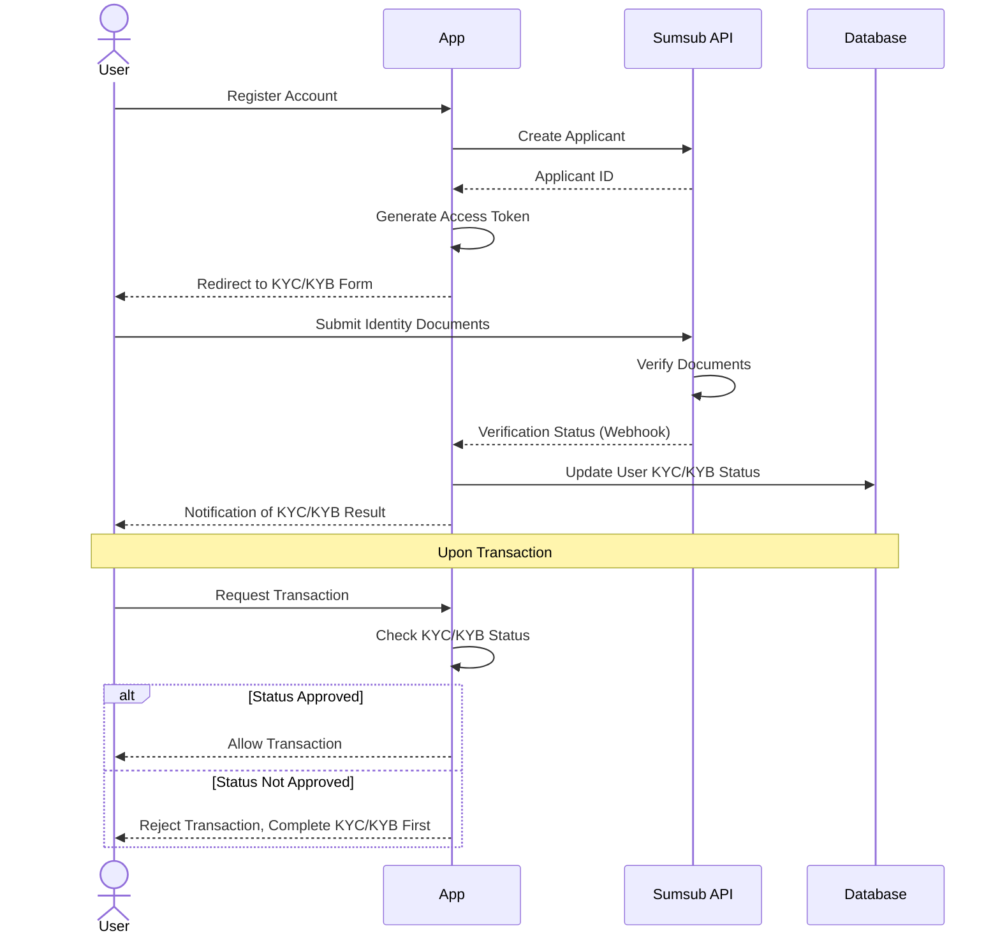
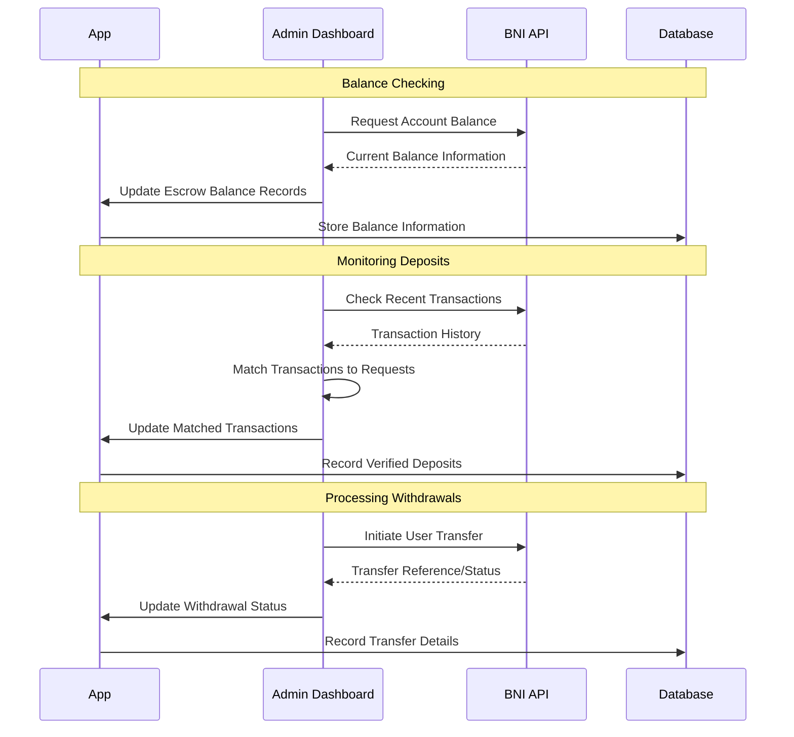
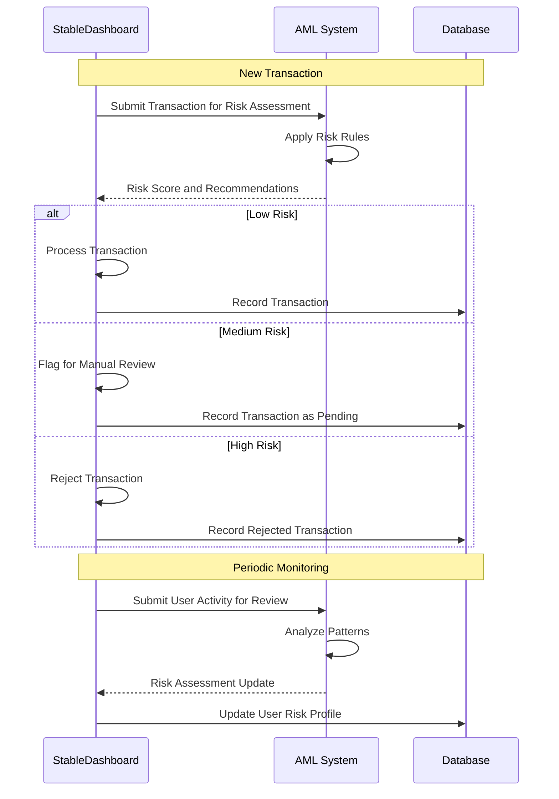

# IDRP Business Process Documentation

## Table of Contents
1. Introduction to IDRP
2. Smart Contract Architecture Overview
3. Business Processes
   - 3.1 Onramp Process (Minting)
   - 3.2 Offramp Process (Burning)
   - 3.3 Pause/Unpause Operations
   - 3.4 Freeze/Unfreeze Operations
4. External Integrations
   - 4.1 KYC/KYB Process with Sumsub
   - 4.2 Banking Integration with BNI
   - 4.3 Anti-Money Laundering (AML) System
5. User Levels and Permissions
6. Security Features

## 1. Introduction to IDRP

IDRP is a stablecoin project built on blockchain technology that facilitates digital representations of the Indonesian Rupiah. The system combines smart contract technology with traditional banking infrastructure to create a bridge between traditional finance and cryptocurrency.

## 2. Smart Contract Architecture Overview

The IDRP system is built on two primary smart contracts:
- `IDRP.sol`: The main token contract implementing the ERC20 standard
- `IDRPController.sol`: Controller contract that manages key operations including minting, burning, freezing, and pausing

The system uses a proxy pattern for upgradability and implements multi-signature requirements for critical operations. For detailed architecture, refer to the [IDRP Smart Contract Architecture](../arch/3.SMART_CONTRACT_ARCH.md) document.

## 3. Business Processes

### 3.1 Onramp Process (Minting)

The onramp process enables users to convert fiat currency (IDR) to IDRP tokens.

#### Sequence Diagram: Minting Process

#### Detailed Minting Process:
1. User logs into the platform and requests to mint IDRP tokens
2. System verifies user's KYC/KYB status
3. User initiates bank transfer to the designated IDRP account at BNI
4. BNI API confirms the transfer receipt to the platform
5. System performs AML check on the transaction
6. If AML check passes:
   - Admin approves minting request
   - Smart contract controller calls mint function
   - Tokens are minted to user's wallet address
7. Transaction details are recorded in the database
8. User receives notification of completed minting

### 3.2 Offramp Process (Burning)

The offramp process allows users to convert IDRP tokens back to fiat currency (IDR).

#### Sequence Diagram: Burning Process

#### Detailed Burning Process:
1. User logs into the platform and requests to burn IDRP tokens
2. System verifies user's identity and bank account details
3. User approves token spending by the controller contract
4. System performs AML check on the transaction
5. If AML check passes:
   - Admin approves burning request
   - Smart contract controller calls burn function
   - Tokens are burned from user's wallet
6. System initiates bank transfer to user's registered bank account through BNI API
7. Transaction details are recorded in the database
8. User receives notification of completed burning and fiat transfer

### 3.3 Pause/Unpause Operations

The platform includes emergency functions to pause and unpause the contract in case of security incidents.

#### Sequence Diagram: Pause/Unpause Process

#### Detailed Pause/Unpause Process:
1. Pause:
   - Admin can pause contract operations in emergency situations
   - When paused, minting, burning, and transfers are disabled
   - Requires single admin signature

2. Unpause:
   - Unpausing requires multiple signatures according to quorum rules
   - Each admin provides their signature
   - System verifies signature count meets quorum threshold
   - Contract operations resume after successful unpause

### 3.4 Freeze/Unfreeze Operations

The platform can freeze individual user addresses if suspicious activity is detected.

#### Sequence Diagram: Freeze/Unfreeze Process

#### Detailed Freeze/Unfreeze Process:
1. Freeze:
   - Admin can freeze specific addresses if suspicious activity is detected
   - Frozen addresses cannot transfer tokens
   - Requires admin signature

2. Unfreeze:
   - Unfreezing an address requires review of risk factors
   - Address must pass AML checks before being unfrozen
   - Requires admin signature

## 4. External Integrations

### 4.1 KYC/KYB Process with Sumsub

The platform integrates with Sumsub for Know Your Customer (KYC) and Know Your Business (KYB) verification.

#### Sequence Diagram: KYC/KYB Process

#### Detailed KYC/KYB Process:
1. User registers on the platform
2. Platform creates applicant profile in Sumsub
3. User is redirected to Sumsub's interface to complete verification
4. User uploads required documents:
   - Individual: ID card, selfie, proof of address
   - Business: Business registration, ownership documents, financial statements
5. Sumsub verifies documents and performs checks
6. Sumsub sends verification result to platform via webhook
7. User's KYC/KYB status is updated in the database
8. User can access features based on their verification level

### 4.2 Banking Integration with BNI

The platform integrates with Bank Negara Indonesia (BNI) for handling fiat transactions.

#### Sequence Diagram: BNI Integration

#### Detailed BNI Integration:
1. Authentication:
   - System authenticates with BNI using client credentials
   - Tokens are refreshed periodically for security

2. Account Verification:
   - System verifies user's bank account details before processing withdrawals
   - Validates account existence and ownership

3. Transaction Processing:
   - For withdrawals (burn), system initiates transfer to user's bank account
   - For deposits (mint), system monitors incoming transfers to IDRP bank account
   - Transaction status is monitored and recorded

4. Reconciliation:
   - Daily reconciliation of banking transactions with blockchain transactions
   - Discrepancies are flagged for review

### 4.3 Anti-Money Laundering (AML) System

The platform integrates with an AML system to monitor and prevent suspicious transactions.

#### Sequence Diagram: AML Process

#### Detailed AML Process:
1. Transaction Screening:
   - Each transaction is screened against AML rules
   - System calculates risk score based on multiple factors:
     - Transaction size and frequency
     - User history and profile
     - Country risk factors
     - Transaction patterns

2. Ongoing Monitoring:
   - User transaction patterns are continuously monitored
   - Unusual activity triggers alerts
   - Risk profiles are updated based on behavior

3. Reporting:
   - Suspicious activities are reported to compliance officers
   - System generates reports for regulatory compliance
   - Audit trail is maintained for all AML checks

## 5. User Levels and Permissions

The IDRP platform implements different user levels with varying permissions:

1. Standard Users:
   - Basic KYC verification
   - Limited transaction amounts
   - Can mint and burn tokens within limits

2. Premium Users:
   - Enhanced KYC verification
   - Higher transaction limits
   - Additional features such as scheduled transactions

3. Business Users:
   - Full KYB verification
   - Enterprise-level transaction limits
   - API access for integrations

4. Administrators:
   - Contract management capabilities
   - User management functions
   - System monitoring and reporting

5. Compliance Officers:
   - Review flagged transactions
   - Manage user risk profiles
   - Generate regulatory reports

## 6. Security Features

The IDRP platform implements multiple security measures:

1. Smart Contract Security:
   - Multi-signature requirements for critical operations
   - Pausable and upgradeable contract design
   - Regular security audits

2. Transaction Security:
   - Two-factor authentication for significant transactions
   - Transaction signing with digital signatures
   - Rate limiting to prevent attacks

3. Infrastructure Security:
   - Encrypted communications
   - Secure key management
   - Regular security assessments

4. Compliance Measures:
   - AML monitoring and filtering
   - KYC/KYB verification
   - Transaction monitoring and reporting